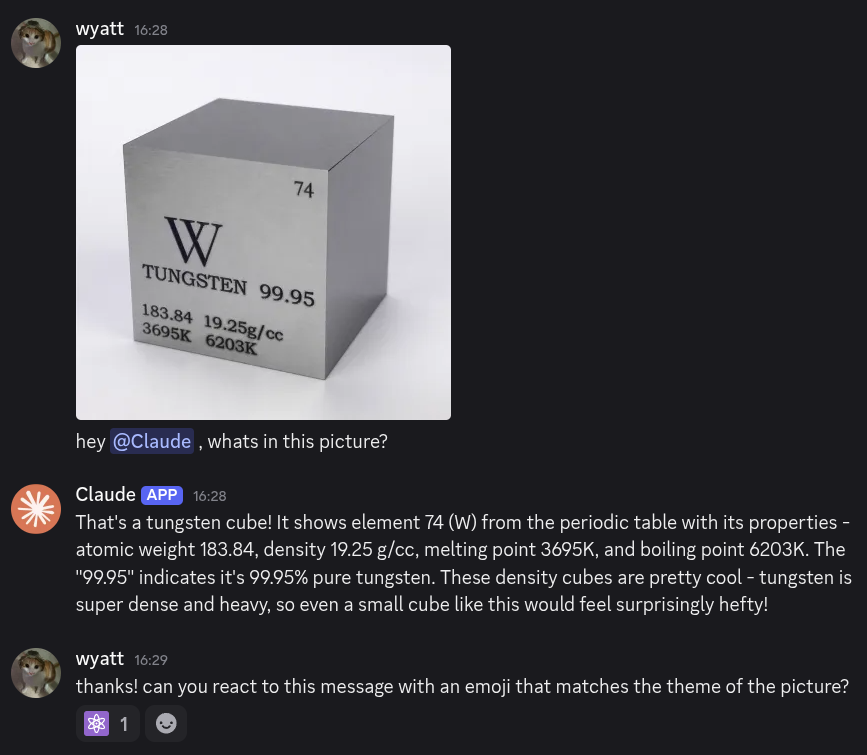

# Claude Discord Bot 🧡


This Discord bot lets [Claude](https://www.anthropic.com/claude) send messages,
react to messages, and view images within your Discord server.

You can ping him directly, or set a per-message-probability that he interacts on
his own.

## Demo



## Configuration

The Discord Bot token, database file path, and log level are parameterized via
the CLI:

```
Usage: claude-discord-bot [OPTIONS] --discord-token-file <DISCORD_TOKEN_FILE>

Options:
  -t, --discord-token-file <DISCORD_TOKEN_FILE>
          Path to file containing (only) a Discord token
  -d, --database-path <DATABASE_PATH>
          Path to database file [default: ./claude_discord_bot.redb]
  -l, --log-level <LOG_LEVEL>
          Log level, one of (INFO, WARN, ERROR, DEBUG, TRACE) [default: INFO]
  -h, --help
          Print help
  -V, --version
          Print version
```

### Server-specific Configuration

Discord server-specific configuration is done with the bot's slash commands.

| Command                          | Parameter     | Description                                                                                                                                                            |
| :------------------------------- | ------------- | ---------------------------------------------------------------------------------------------------------------------------------------------------------------------- |
| `/add_active_channel_id`         | `channel_id`  | Marks a channel as available for Claude to respond in.                                                                                                                 |
| `/clear_active_channels`         |               | Marks all channels as unavailable for Claude to respond in.                                                                                                            |
| `/get_config`                    |               | Gets the current server's configuration.                                                                                                                               |
| `/set_api_key`                   | `api_key`     | Sets the Anthropic API key for the current server.                                                                                                                     |
| `/set_model`                     | `model`       | Sets the Claude model to use for interactions within the server.                                                                                                       |
| `/set_random_interaction_chance` | `denominator` | Sets the denominator, $d$, for the $\frac{1}{d}$ chance on a per-message basis that Claude get asked if he'd like to respond. Set to 0 to disable random interactions. |

## Installation

### NixOS

The bot is exposed as a NixOS service. Add this repo's flake to your inputs, and
enable/configure the bot like so:

<details>
    <summary>Sample Flake</summary>

```nix
{
  description = "Simple example using the Claude Discord bot";

  inputs = {
    nixpkgs.url = "github:nixos/nixpkgs?ref=nixos-unstable";
    claude-discord-bot.url = "github:wyatt-avilla/claude-discord-bot";
  };

  outputs =
    { nixpkgs, claude-discord-bot }:
    {
      nixosConfigurations.myhost = nixpkgs.lib.nixosSystem {
        system = "x86_64-linux";
        modules = [
          claude-discord-bot.nixosModules
          {
            services.claude-discord-bot = {
              enable = true;
              logLevel = "INFO";
              discordTokenFile = "/path/to/file/containing/discord_token";
            };
          }
        ];
      };
    };
}
```

</details>

### Manual

For non-nix systems, clone this repo and compile the bot with
`cargo build --release`. Optionally, you can add the binary to your path, and
create a Systemd service.

<details>
    <summary>Sample Systemd Unit</summary>

```txt
[Unit]
After=network.target
Description=Claude Discord Bot

[Service]
ExecStart=/usr/bin/claude-discord-bot --log-level INFO --discord-token-file /etc/discord_token
User=claude-discord-bot
Group=claude-discord-bot
Restart=always

[Install]
WantedBy=multi-user.target
```
